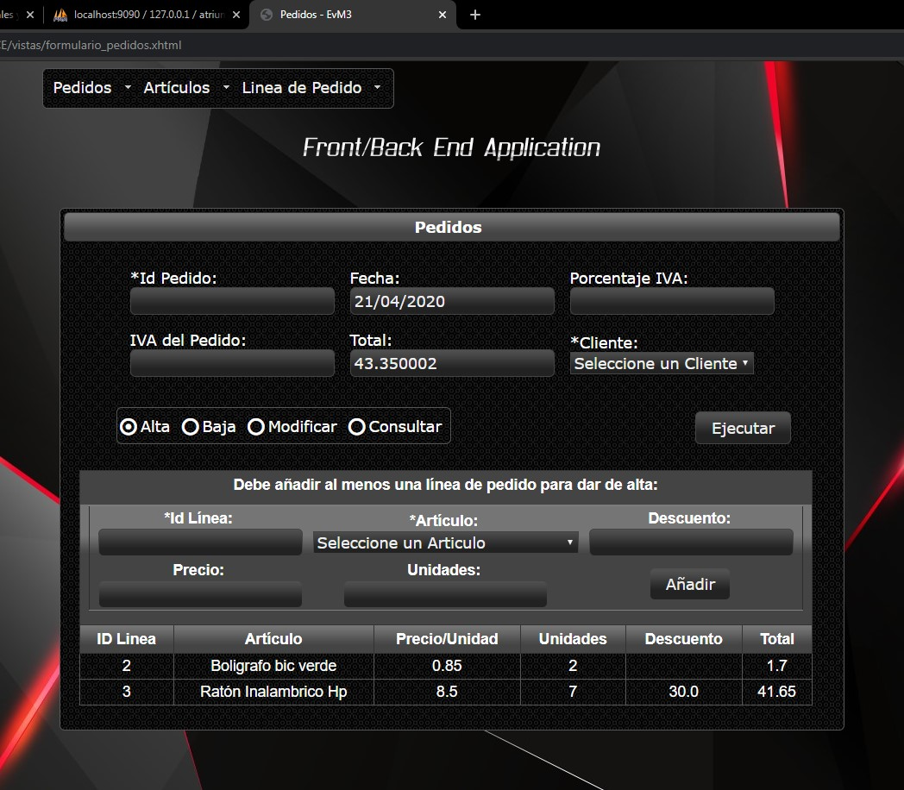
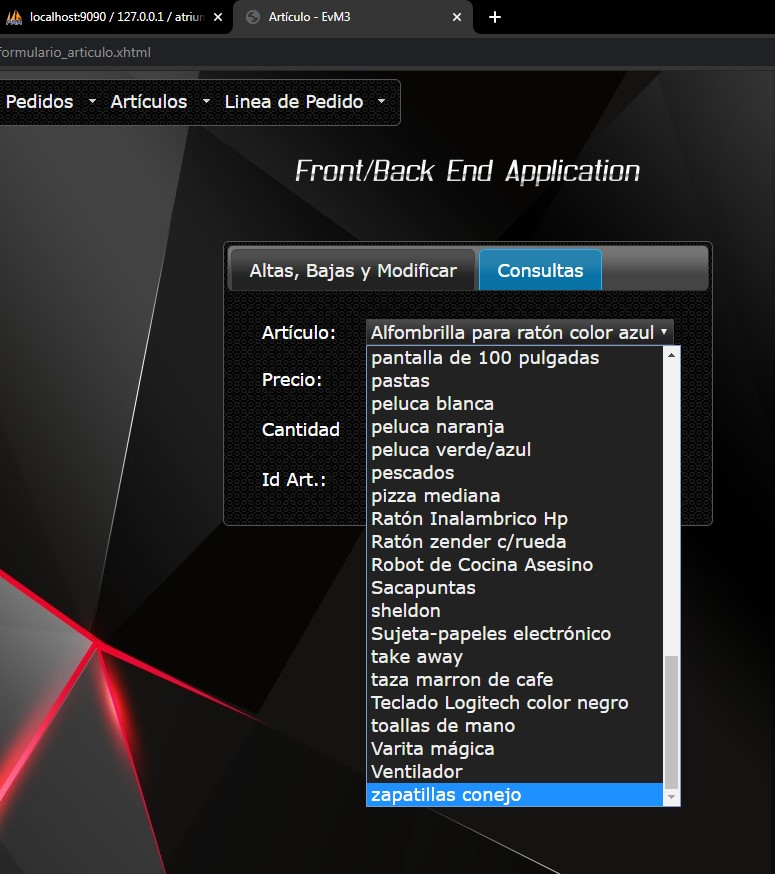
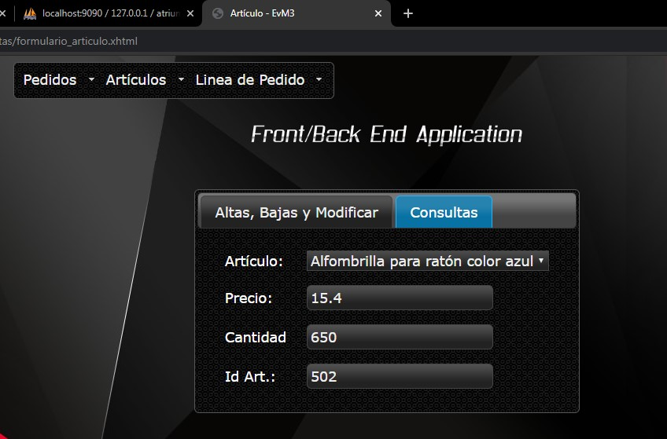
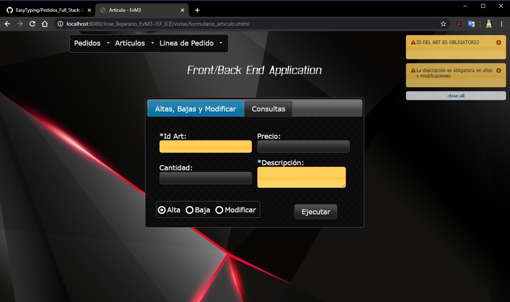

#Pedidos front-backend 

Front / Back End Web application for CRUD processes with MVC pattern (JSF + IceFaces, Hibernate, Spring). Dependency managers have not been used, all libraries are included in the project. The structure of the DB corresponds to the DTOs of the application, it is composed of 4 tables: Customers, Articles, Orders and Line_Order. To configure the connection to the DB, change the connection parameters in com.spring.datos-conexion.properties and com.config.hibernate.cfg.xml Both when deleting or modifying an order, such as an item, their associated lines are deleted and modified. The GUI for the Clients table has not been included yet, just the simplified DTO and DAO. A template has been used for the menu and a CSS for the positioning.

